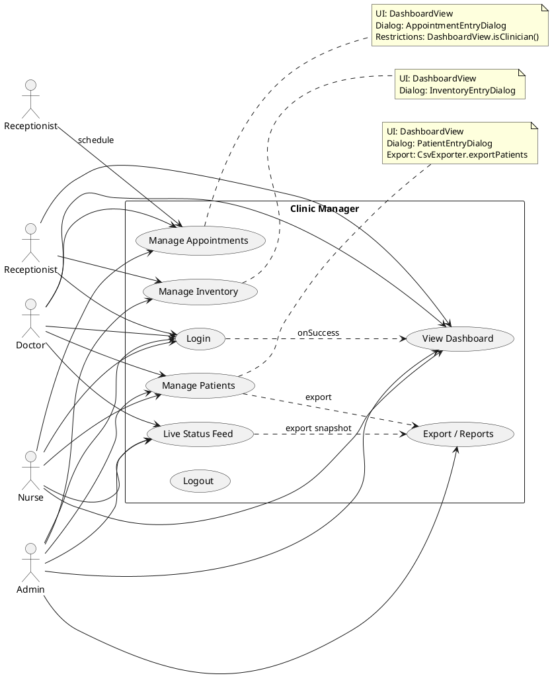

# Clinic Manager — Use Case Diagram

This document describes the main use cases for the Clinic Manager app and maps UI interactions to code components and functions. It includes a PlantUML diagram you can render to see a visual illustration.

---

## Actors

- Doctor (role contains "doctor")
- Nurse (role contains "nurse")
- Admin (role contains "admin")
- Receptionist / Staff (generic staff user)

## High-level Use Cases

- Authenticate (login)
- View Dashboard (overview)
- Manage Patients
  - Add Patient
  - Edit Patient
  - Discharge Patient
  - Change Room
  - Export Patients CSV
- Manage Inventory
  - Add Item
  - Edit Item
  - Remove Item
- Appointments
  - Create Appointment (Doctor/Nurse)
  - Edit Appointment (Doctor/Nurse)
  - Cancel Appointment (Doctor/Nurse)
- Live Status Feed
  - View status messages
  - Export status snapshot (CSV)
- Reports & Utilities
  - Export users
  - Generate reports
  - Reset password
  - Clear settings
- Logout (persistent logout control)

## Code Mapping (UI ? functions/classes)

- Authentication
  - `LoginView.handleLogin` ? uses `AuthService.authenticate` and `AppUser.withPassword` fallback
  - `SettingsStore.persistLastLogin` stores last user

- Dashboard / Navigation
  - `DashboardView.start`, `DashboardView.navigateTo`, `DashboardView.buildNavBar`
  - `DashboardView.buildHeroSection`, `DashboardView.buildStatsRow` show metrics

- Patient management
  - `DashboardView.addPatientRecord` ? `PatientEntryDialog.request` ? creates `PatientRecord`
  - `DashboardView.editPatientRecord` ? `PatientEntryDialog.request` with existing
  - `DashboardView.removePatientRecord` (discharge)
  - `DashboardView.changePatientRoom` ? `PromptDialog.request`
  - `CsvExporter.exportPatients` exports current `patients` list

- Inventory management
  - `DashboardView.addInventoryItem` ? `InventoryEntryDialog.request` ? creates `InventoryItem`
  - `DashboardView.editInventoryItem` / `removeInventoryItem`
  - `DashboardView.createInventoryTable` shows `id`, `name`, `quantity`, `price`, `status`

- Appointments
  - `DashboardView.addAppointment` ? `AppointmentEntryDialog.request` ? creates `Appointment`
  - `DashboardView.editAppointment` / `removeAppointment` (restricted by `DashboardView.isClinician`)
  - `DashboardView.createAppointmentTable` displays appointments

- Status & Exports
  - `DashboardView.buildStatusView` shows `buildStatusList`
  - `DashboardView.exportStatusSnapshot` ? `CsvExporter.exportStatusSnapshot` (writes time + patient statuses)
  - `CsvExporter.exportUsers` and `generateReports` for broader exports

- Dialogs & Theming
  - `PatientEntryDialog`, `InventoryEntryDialog`, `AppointmentEntryDialog`, `PromptDialog` use `app.css` for theme
  - Alerts use `info` / `error` helpers in `DashboardView` (adds dialog CSS classes)

- Logout
  - `DashboardView.logout` invoked from bottom-left `Logout` button and settings view `Log out` button

---

## PlantUML Use Case Diagram

Copy the block below into a PlantUML renderer (online or local) to produce a diagram.

---

## ASCII Interaction Overview (quick)

- User opens app ? `LoginView` ? `AuthService` ? on success `DashboardView.start`
- From `DashboardView` user clicks nav ? `navigateTo` loads corresponding view
- Add patient ? `PatientEntryDialog` ? returned `PatientRecord` ? `patients.add(...)`
- Create appointment (doctor/nurse) ? `AppointmentEntryDialog` ? `appointments.add(...)`
- Add inventory ? `InventoryEntryDialog` ? `inventoryItems.add(...)`
- Export status ? `CsvExporter.exportStatusSnapshot(patients)` writes CSV with capture time

---

If you want, I can also add a rendered PNG/SVG of the PlantUML output into the `docs/` folder (requires PlantUML rendering).